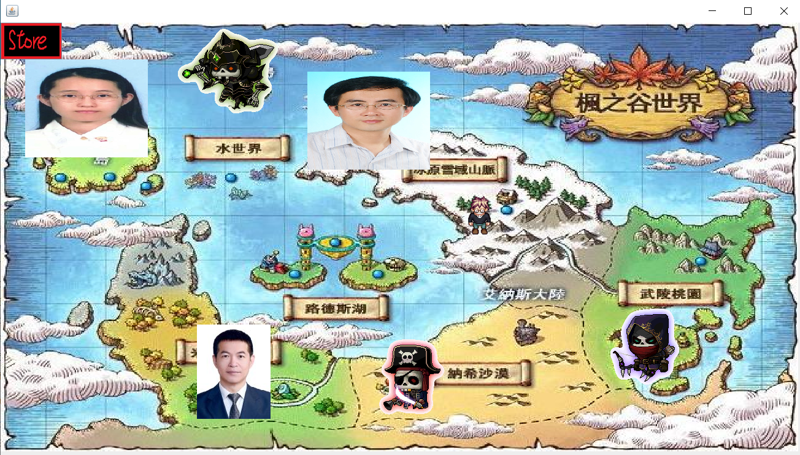
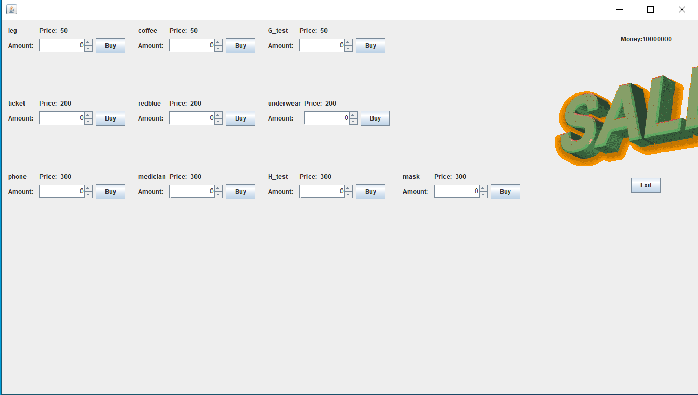

# About this game
This is the JAVA class final project, our team made this game in 2020, this is a very simple RPG game. The player have to defeat all the enemies on the game map, 
which contain 6 boss and some random enemies, afer defeating these enemis, the player can earn money and buy the powerful item from the store system, all boss have it weakness, 
player have to use the specific item to defeat the corresponeding boss.

# How to play
## Game map

## Move 
The player use the arrow key on key board to move the character.

Once the character encounter the enemy, the battle start.

## Encounter

You can also find that the status of player and enemy are shown on the screen.

## Store
Player can buy items in the store by clicking the store button.

## The battle with items
If the player have items, it would show on screen when encounter a enemy.

Good to mention that in this battle scene I use the Mask item, which can stop the movment of specific boss.

